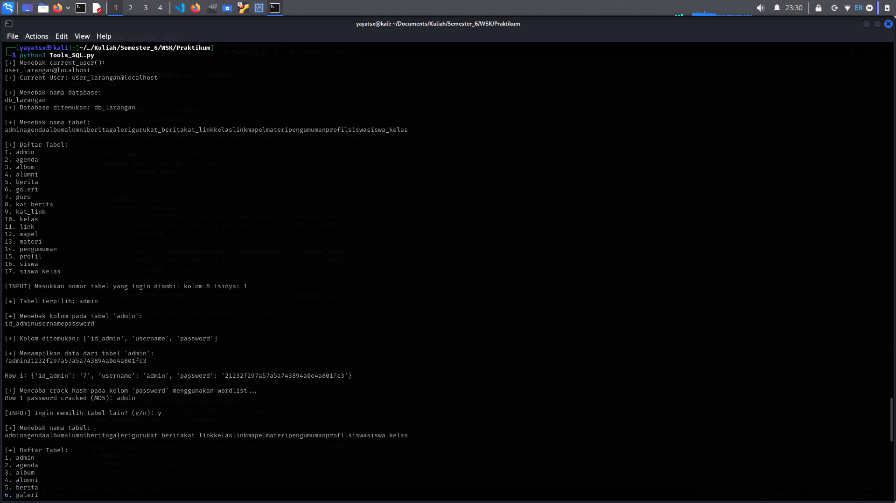

# Script Automation for SQL-INJECTION

## Overview

This Python script is a SQL injection automation tool designed to extract sensitive information from vulnerable web applications by exploiting insecure login forms. It automates blind SQL injection to retrieve the current database user, database name, table names, column names, and table data by iteratively guessing each character using crafted SQL payloads. Additionally, it includes a basic password hash cracker that attempts to break MD5 or SHA1 hashed passwords using a small built-in wordlist. This tool is intended for penetration testing and ethical hacking purposes only, and misuse against systems without explicit authorization is illegal and unethical.  

*All rights reserved. Use this script responsibly and only for authorized testing purposes.*  
*The author is not responsible for any damage or loss resulting from misuse.*  
© 2025 Melkorxr
